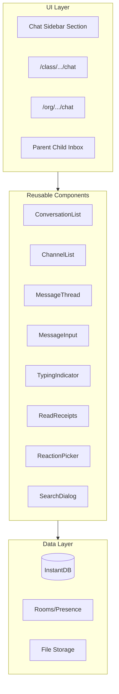

# Chat Feature Implementation Plan

## Architecture Overview




## Schema Changes

Add these new entities to [`instant.schema.ts`](src/instant.schema.ts):**Entities:**

- `chatConversations` - Direct message threads (1-on-1 or small groups)
- `chatChannels` - Group channels within classes/orgs
- `chatMessages` - Messages with content, timestamps, attachments
- `chatReactions` - Emoji reactions on messages
- `classSettings` - Class-level configuration including chat toggle

**Key Links:**

- Messages linked to conversations OR channels
- Messages linked to author
- Conversations linked to participants and optionally class/org
- Channels linked to class or org
- Read receipts tracked per user per conversation/channel

## Permission Rules

Update [`instant.perms.ts`](src/instant.perms.ts) with chat-specific rules:| Entity | Create | View | Update | Delete ||--------|--------|------|--------|--------|| chatConversations | Participants only | Participants only | Participants | Owner only || chatChannels | Teachers/admins/owner | Class/org members | Creator/admin | Creator/admin || chatMessages | Conversation/channel member | Member or parent of participant | Author only | Author only || chatReactions | Anyone who can view message | Anyone who can view message | Author | Author |**Special permission: Parent read-only access** - Parents can view messages where their child is a participant, but cannot send messages to those conversations.

## Component Structure

Create reusable components in [`src/components/chat/`](src/components/chat/):

```javascript
chat/
  index.ts                    # Public exports
  chat-provider.tsx           # Context for chat state
  conversation-list.tsx       # List of DM conversations
  channel-list.tsx            # List of group channels
  message-thread.tsx          # Message display with scroll
  message-item.tsx            # Individual message bubble
  message-input.tsx           # Input with file upload
  typing-indicator.tsx        # "X is typing..." display
  read-receipts.tsx           # Seen/delivered indicators
  reaction-picker.tsx         # Emoji reaction selector
  reaction-display.tsx        # Show reactions on messages
  new-conversation-dialog.tsx # Start DM with eligible users
  new-channel-dialog.tsx      # Create group channel
  search-dialog.tsx           # Search messages
  chat-sidebar-section.tsx    # Sidebar integration
  parent-inbox.tsx            # Read-only child message view
  notification-badge.tsx      # Unread count badge
  hooks/
    use-conversations.ts      # Query conversations
    use-messages.ts           # Query messages with pagination
    use-typing.ts             # Typing indicator logic
    use-can-message.ts        # Permission checks for who can message whom
```


## Pages

**Class Chat Page:** `src/app/class/[orgId]/[classId]/chat/page.tsx`

- Full chat interface for class context
- Shows channels and DMs relevant to the class

**Org Chat Page:** `src/app/org/[orgId]/chat/page.tsx`

- Chat interface for organization context
- Shows org-level channels and DMs

**Class Settings Update:** Add chat toggle to `src/app/class/[orgId]/[classId]/settings/page.tsx`

- Toggle to enable/disable student chat
- Managed by class teachers/admins/owner

## Messaging Permission Matrix

| Sender | Can Message ||--------|-------------|| Parent | Teachers, admins, owner of child's class; org owner/admins || Student | Teachers, admins of class (if chat enabled) || Class Teacher | Anyone in class; org teachers/admins/owner || Class Admin | Owner, other admins, teachers of class || Class Owner | Admins, teachers of class || Org Admin | Owner, other admins, teachers of all classes in org |

## Real-time Features

Using InstantDB rooms for ephemeral data:

- `chat-typing-{conversationId}` - Typing indicators per conversation
- `chat-presence-{classId}` / `chat-presence-{orgId}` - Online status

## Implementation Phases

This is a large feature - recommend implementing in phases:

1. **Phase 1 (Core):** Schema, permissions, basic DMs, message thread
2. **Phase 2 (Channels):** Group channels, channel creation